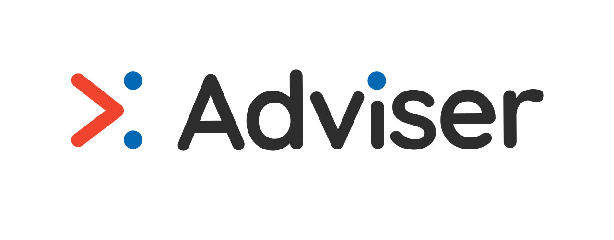

<p align="center">
  <a href="https://terminalizer.com">
    
  </a>
</p>

# Adviser

[](https://www.npmjs.com/package/adviser)
[](https://github.com/jam3/adviser/blob/master/LICENSE)
[](https://travis-ci.org/Jam3/adviser)
[](https://snyk.io/test/github/jam3/adviser)

[](https://codeclimate.com/github/Jam3/adviser/maintainability)

> Modular task runner with a linter fashion

> https://jam3.github.io/adviser

<p align="center"></p>

> Thanks [@pedrohsbarroso](https://twitter.com/pedrohsbarroso) for the logo

---

# Table of Contents

- [Installation](#installation)
- [Usage](#usage)
- [Built in rules](#built-in-rules)
- [Release](#release)
- [Tests](#tests)
- [API](#api)
- [Contributing](#contributing)
- [Support](#support)
- [Related](#related)
- [License](#license)

## Installation

```
npm install -g adviser
```

## Usage

Adviser's goal is to run rules defined in a configuration file. It doesn't get involve in what the rules do; it just run them and control them.

In order to use it, you need to:

1. Create a configuration file
2. (Optional) Install the plugins you've like to use
3. Set the rules we want to use

### Run adviser

`$ adviser`

If you run adviser without any arguments it will try to find a valid configuration file in the current directory and continues in through the parent directories until find a configuration file.

### CLI Arguments

`-c, --config` Specify config file path

`-i, --init` Run config initialization wizard

`-d, --debug` Output debugging information

`-v, --verbose` Display extra information

`-t, --tags` Run rules that match tags

`-h, --help` Show help

`-r, --version` Output the version number

### Configuration example file

```
{
  "plugins": ["plugin1", "plugin2"],
  "rules": {
    "plugin1/exampleWarnRule": "warn",
    "plugin1/exampleErrorRule": "error",
    "plugin1/exampleOffRule": "off",
    "plugin2/exampleNumberWarnRule": 1,
    "plugin2/exampleNumberErrorRule": 2,
    "plugin2/exampleNumberOffRule": 0,
    "plugin2/exampleFullWarnRule": ["warn", {options: 'options'}],
    "plugin2/exampleFullErrorRule": ["error", {name: 'plugin'}],
    "plugin2/exampleFullNumberWarnRule": [1, {name: 2}],
    "plugin2/exampleFullNumberErrorRule": [2, {}]
  }
}
```

## Built in rules

All the rules documentation is located inside `/docs/rules`

_Rules_:

- package-json-properties: Includes options to restrict and blacklist properties on the package.json
- root-files: Includes options to restrict and blacklist files on the root directory.

## Release

To releasing new versions we are using [standard-version](https://github.com/conventional-changelog/standard-version).

Steps:

1. When PRs/commits land to your master branch, select the Squash and Merge option.
2. Add a title and body that follows the [Conventional Commits Specification](https://www.conventionalcommits.org).
3. Run `$ git checkout master; git pull origin master`
4. Run `$ npm run release`
5. Run `$ git push --follow-tags origin master && npm publish`

## Tests

### Unit Tests

There is a small set of tests implemented using Jest, to run them use: `$ npm test`

### Integration Tests

To test `adviser` running with built-in rules, run `$ npm run adviser` on the directory `__tests__/integration`

#### External Plugins

To use plugins and rules you can install one of the plugins created by the same team that created adviser:

- [https://github.com/Jam3/adviser-plugin-dependencies](https://github.com/Jam3/adviser-plugin-dependencies)
- [https://github.com/Jam3/adviser-plugin-audit-npm](https://github.com/Jam3/adviser-plugin-audit-npm)

## Contributing

Please read [CONTRIBUTING.md](CONTRIBUTING.md) for details on our code of conduct, and the process for submitting
pull requests.

## License

[MIT](LICENSE)
